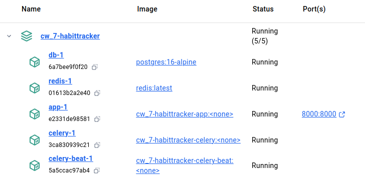

### Трекер полезных привычек с напоминанием в Telegram
#### Для отправки напоминания нужно получить chat_id telegram и заполнить его при регистрации
#### Docker: app, postgres, redis, celery, celery-beat
#### Запуск docker с poetry: 
1. Установить docker-desktop
2. Запустить docker-desktop: systemctl --user start docker-desktop
3. Запустить контейнеры: docker-compose up --build

#### Библиотеки:
* django | "Основной фреймворк"
* psycopg2-binary | "Взаимодействия с PostgreSQL из Python."
* black | "Автоматически форматирует код"
* python-dotenv | "Работа с переменными окружения"
* djangorestframework | "Создание RESTful API"
* djangorestframework-simplejwt | "Работа с JSON Web Token JWT"
* celery | "Обработки фоновых задач"
* django-celery-beat | "Расширение для интеграции Celery с Django"
* python-telegram-bot | "Создание бота Telegram на Python"
* flake8 | "Проверка кода на соответствие стандартам PEP8"
* redis | "Управление задачами"
* requests | "Выполнение HTTP-запросов telegram"
* coverage | "Покрытие тестами"
* django-cors-headers | "Контроль доступ к API из других доменов"
* drf-yasg | "Генерация API документации Swagger, Redoc"

#### Эндпоинты для пользователей:

    Регистрация
        POST /users/register/

    Авторизация
        POST /users/login/

#### Эндпоинты для привычек:

    Список привычек текущего пользователя
        GET /habit/my-habits/

    Список публичных привычек
        GET /habit/public-habits/

    Создание привычки
        POST /habit/my-habits/

    Редактирование привычки
        PUT /habit/my-habits/<id>/
        PATCH /habit/my-habits/<id>/

    Удаление привычки
        DELETE /habit/my-habits/<id>/